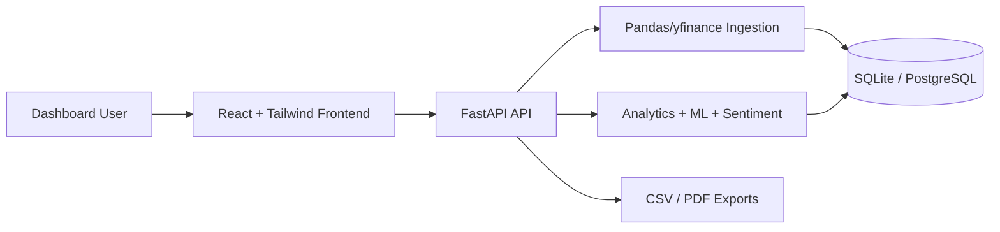

# StockSense AI Pro

StockSense AI Pro is a full-stack AI-powered stock market intelligence dashboard built for the JarNox software intern assignment and upgraded into a premium fintech SaaS-style project.

It collects real stock market data, cleans and stores it, calculates financial metrics and technical indicators, generates AI-style recommendations, predicts next-day close prices, analyzes news sentiment, exposes REST APIs, and renders an interactive React dashboard.

## Highlights

- Real NSE stock data through `yfinance`
- FastAPI backend with Swagger docs at `/docs`
- SQLite-first SQLAlchemy database with PostgreSQL-ready config
- Pandas data cleaning and enrichment
- RSI, MACD, Bollinger Bands, EMA, SMA, moving averages, volatility, drawdown
- BUY/HOLD/SELL recommendation engine with confidence and factor breakdown
- Linear Regression next-day close prediction
- Vader sentiment analysis with yfinance news and demo-safe fallback headlines
- React + TailwindCSS fintech dashboard
- Candlestick, line, volume, prediction, comparison, and heatmap views
- Watchlist, demo portfolio intelligence, CSV/PDF exports
- Docker, GitHub Actions CI, Render and Vercel-ready deployment config

## Architecture



## API Endpoints

| Method | Endpoint | Purpose |
| --- | --- | --- |
| GET | `/health` | Service health |
| GET | `/companies` | Supported companies |
| POST | `/ingest` | Refresh all stocks |
| POST | `/ingest/{symbol}` | Refresh one stock |
| GET | `/data/{symbol}?range=30D` | OHLCV + metrics |
| GET | `/summary/{symbol}` | 52-week high/low, volatility, average close |
| GET | `/indicators/{symbol}` | RSI, MACD, Bollinger, EMA, SMA |
| GET | `/recommendation/{symbol}` | AI-style BUY/HOLD/SELL insight |
| GET | `/predict/{symbol}` | Next-day close prediction |
| GET | `/sentiment/{symbol}` | News sentiment snapshot |
| GET | `/compare?symbol1=TCS&symbol2=INFY` | Stock comparison |
| GET | `/market/overview` | Market cards |
| GET | `/market/heatmap` | Gain/loss heatmap data |
| GET/POST/DELETE | `/watchlist` | Watchlist features |
| GET/POST/DELETE | `/portfolio` | Demo portfolio intelligence |
| GET | `/export/{symbol}.csv` | CSV export |
| GET | `/export/{symbol}.pdf` | PDF report |

## Local Setup

### Backend

```bash
cd backend
python -m venv .venv
.venv\Scripts\activate
pip install -r requirements.txt
uvicorn main:app --reload
```

Open:

- API: `http://localhost:8000`
- Swagger: `http://localhost:8000/docs`

Seed live data:

```bash
curl -X POST http://localhost:8000/ingest
```

### Frontend

PowerShell may block `npm.ps1` on Windows, so use `npm.cmd`:

```bash
cd frontend
npm.cmd install
npm.cmd run dev
```

Open `http://localhost:5173`.

## Docker

```bash
docker compose up --build
```

- Frontend: `http://localhost:8080`
- Backend: `http://localhost:8000`

## Deployment

Backend:

- Use Render.
- Root directory: `backend`
- Build command: `pip install -r requirements.txt`
- Start command: `uvicorn main:app --host 0.0.0.0 --port $PORT`

Frontend:

- Use Vercel.
- Root directory: `frontend`
- Set `VITE_API_BASE_URL` to the deployed backend URL.
- Recommended production value: `https://stocksense-ai-pro-api.onrender.com`

Live URLs:

- Backend: pending user deployment
- Frontend: pending user deployment
- GitHub: pending repository creation

## Screenshots

Add screenshots after running the app:

- `docs/screenshots/dashboard.png`
- `docs/screenshots/swagger.png`
- `docs/screenshots/report.png`

## Future Improvements

- Real authentication
- PostgreSQL production migration
- WebSocket live ticks
- LSTM or Prophet forecasting
- Broker portfolio integration
- Paid news provider integration
- OpenAI-powered analyst assistant

## Disclaimer

StockSense AI Pro is an educational analytics project. It is not financial advice.
