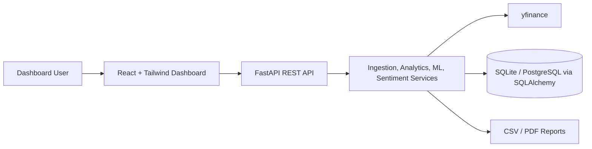

# StockSense AI Pro Architecture

## Runtime Flow

1. FastAPI starts, creates tables, and seeds supported NSE companies.
2. `/ingest` pulls yfinance OHLCV data, cleans it with Pandas, and upserts prices.
3. Analytics endpoints calculate metrics and indicators from stored prices.
4. Prediction uses Linear Regression over recent technical features.
5. Sentiment uses yfinance news plus deterministic fallback headlines.
6. React polls the API every 30 seconds and renders charts, AI insights, heatmap, comparison, and exports.
